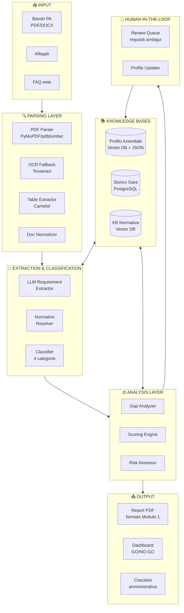
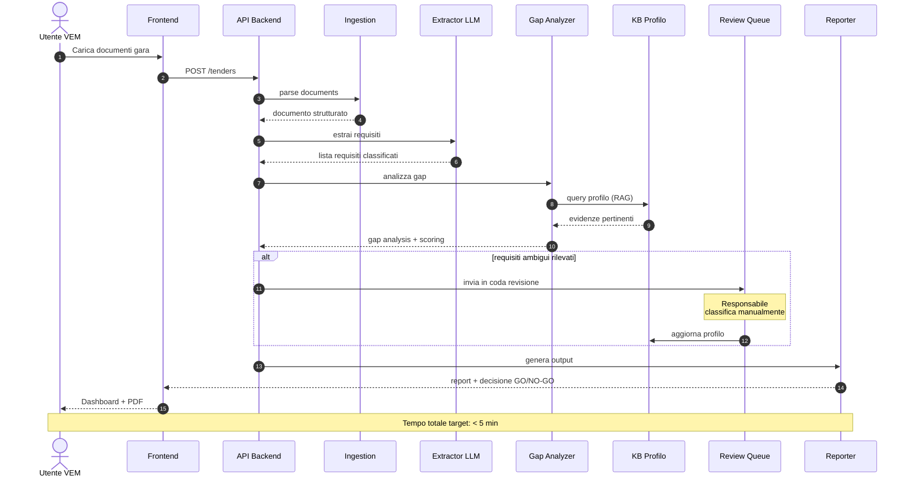

# Smart Tender Compliance Assistant
## Documento di brainstorming pre-kickoff

> **Challenge VEM Sistemi — GenAI Innovation Sprint 2026**
> Documento di lavoro per la call di kickoff del 14/15 maggio 2026
> Versione 1.0 — preparato sulla base di: capitolato anonimizzato (gara EDR 36 mesi), Modulo 1 di estrazione requisiti già prodotto da VEM, brief della challenge.

---

## 1. Vision & elevator pitch

> **Un sistema GenAI che legge un bando, lo confronta con il profilo aziendale di VEM, e in pochi minuti produce una decisione GO/NO-GO motivata, tracciabile e auditabile — sostituendo ore di lavoro manuale di analisti.**

Il sistema non è un semplice "estrattore di requisiti": è un **assistente decisionale** che apprende dallo storico gare e dal feedback umano, arricchendo nel tempo la propria conoscenza del profilo aziendale.

---

## 2. Problema e contesto

### Pain attuale
- **Tempi**: l'analisi manuale di un bando PA medio richiede ore-uomo di un commerciale o pre-sales senior.
- **Errori**: il confronto requisiti ↔ certificazioni aziendali è soggetto a sviste; un requisito escludente non rilevato in fase di analisi si traduce in offerte perse o, peggio, esclusioni in gara.
- **Mancata standardizzazione**: ogni analista applica il proprio metodo, rendendo le decisioni go/no-go non confrontabili nel tempo.
- **Knowledge loss**: l'esperienza accumulata su gare passate (referenze valide, gap risolti, esiti) resta nella testa delle persone, non in un sistema strutturato.

### Opportunità
La GenAI moderna è particolarmente forte su tre task che mappano perfettamente sul problema:
1. Estrazione strutturata da documenti giuridico-amministrativi lunghi
2. Reasoning su criteri di conformità complessi (con citation/tracing)
3. Pattern matching semantico tra requisiti espressi in linguaggio naturale e capacità aziendali

---

## 3. Insight dal capitolato analizzato

L'analisi del capitolato EDR anonimizzato (52.500 € / 36 mesi / MePA) e del Modulo 1 prodotto da VEM rivela pattern che il sistema deve gestire **come cittadini di prima classe**, non come edge case:

| Pattern | Implicazione progettuale |
|---|---|
| Bandi multi-documento (capitolato + allegati + bando d'oneri) | Ingestion deve essere multi-file con cross-reference |
| Vendor lock-in esplicito (SKU specifici di un singolo fornitore) | Sistema deve flaggare requisiti che pre-determinano l'eleggibilità |
| Requisiti via rinvio normativo (D.lgs. 36/2023, GDPR Art. 28, L. 136/2010) | Servono knowledge base normative o LLM con buon recall giuridico |
| Tabelle SKU con quantità/date/scadenze | Estrazione tabellare strutturata, non solo testo libero |
| Penali con soglie cumulative (10% → risoluzione automatica) | Modello di rischio quantitativo, non solo qualitativo |
| Procedure sotto soglia MePA → nessuna graduatoria, solo escludenti | Doppio flusso: gare a punteggio vs gare pass/fail |
| Codici univoci ufficio / CIG / CUP / IBAN dedicato | Sistema deve produrre **checklist amministrativa**, non solo go/no-go |
| Placeholder anonimizzati `[OMESSO]` nei test | Pipeline deve essere robusta a campi mancanti/da inserire post-aggiudicazione |

### Cosa sorprende — e perché conta
Nella gara analizzata **tutti i 30 requisiti sono escludenti o obblighi di legge; zero preferenziali**. Significa che il sistema non deve essere progettato per "ottimizzare punteggio tecnico" come prima feature: la prima feature è **non sbagliare il pass/fail**. La graduatoria tecnica è un caso d'uso aggiuntivo, non il principale.

---

## 4. Requisiti del sistema

### 4.1 Requisiti funzionali

#### F1 — Ingestion & Parsing multi-documento
- Input: PDF (nativi e scansionati), DOCX
- Output: rappresentazione strutturata con preservazione di articoli numerati, tabelle, riferimenti incrociati
- Sotto-componenti: estrazione testo, estrazione tabelle, OCR per scansioni
- **Non gestito dall'LLM end-to-end**: pre-strutturazione necessaria per non perdere riferimenti agli articoli

#### F2 — Estrazione e Classificazione Requisiti
Output: lista strutturata di requisiti, ognuno con:
```json
{
  "id": "REQ-001",
  "testo_originale": "...",
  "categoria": "NORMATIVA | QUALIFICAZIONE | TECNICA | AMMINISTRATIVA",
  "tipo": "ESCLUDENTE | PREFERENZIALE | INFORMATIVO",
  "fonte": "Art. 8, Capitolato",
  "riferimenti_normativi": ["GDPR Art. 28", "D.lgs. 36/2023"],
  "evidenze_richieste": ["Iscrizione MePA", "DPA firmato"],
  "penale_associata": "1‰ netto contrattuale",
  "scadenza": "01/01/AAAA"
}
```

#### F3 — Gap Analysis Certificazioni e Qualifiche
- Confronto requisito-per-requisito tra bando e profilo aziendale
- Output per ogni requisito: `match (full / partial / none)`, evidenza proposta, severità del gap, suggerimento di rimedio, effort stimato
- Distinzione netta tra **gap critici** (escludenti) e **gap minori** (preferenziali, impattano solo punteggio)

#### F4 — Profilo Aziendale come KB auto-arricchente
Tre meccanismi di apprendimento (già ben articolati nelle note Asana):
- **Arricchimento per gap risolto**: quando l'azienda colma un gap (nuova certificazione, nuova referenza), il sistema notifica il responsabile e aggiorna il profilo
- **Apprendimento da requisiti inattesi**: requisiti non mappabili entrano in coda di revisione umana → vengono classificati → arricchiscono il profilo
- **Storico gare come fonte di evidenza**: ogni gara completata (vinta/persa/ritirata) diventa record permanente; suggerisce evidenze per gare future di tipo simile

#### F5 — Scoring & Decisione GO/NO-GO
Modello a due livelli (vedi §6):
- **Hard gate**: requisiti escludenti — un solo gap critico → NO-GO automatico
- **Soft scoring**: per gare a punteggio, calcolo del punteggio tecnico atteso
- Output: decisione + motivazione human-readable + lista azioni richieste

#### F6 — Output & Reporting
- Report PDF stampabile in formato analogo al Modulo 1 di VEM
- Dashboard interattiva con drill-down per categoria di requisito
- Checklist amministrativa auto-generata (lista documenti da preparare se GO)
- Notifiche al responsabile quando gap viene risolto o nuova gara matchata

### 4.2 Requisiti non funzionali

| # | Requisito | Target/criterio |
|---|---|---|
| NF1 | **Tracciabilità (citation)** | Ogni claim del sistema deve linkare all'articolo/sezione di origine. Non negoziabile per uso PA. |
| NF2 | **Spiegabilità** | Per ogni decisione, motivazione leggibile da un umano. No black-box. |
| NF3 | **Performance** | Analisi end-to-end di un bando in < 5 minuti (target indicativo, da concordare) |
| NF4 | **Privacy & sicurezza** | Bandi pubblici, ma profilo aziendale e storico gare confidenziali → impatta scelta cloud/on-prem |
| NF5 | **Robustezza** | Pipeline OCR per scansioni; gestione di campi vuoti/placeholder |
| NF6 | **Costo per gara** | Stima costo computazionale per gara analizzata; metrica utile per business case |
| NF7 | **Human-in-the-loop** | Coda di revisione umana per requisiti ambigui non è fallback ma feature di design |
| NF8 | **Audit trail** | Ogni decisione del sistema (e revisione umana) deve essere loggata e riesumabile |

---

## 5. Architettura proposta

### 5.1 Diagramma logico



### 5.2 Stack a tre livelli per memorizzazione e recupero

| Livello | Contenuto | Tecnologia | Quando si usa |
|---|---|---|---|
| **L1 — Estrazione on-demand** | Requisiti del bando in analisi | Pipeline LLM + parser | Una volta per bando, all'ingestion |
| **L2 — RAG su profilo aziendale** | Certificazioni, referenze, competenze, evidenze tecniche | Vector DB (Qdrant) + metadati | Durante la gap analysis, per recuperare evidenze pertinenti |
| **L3 — Storico strutturato** | Gare passate, esiti, decisioni, audit log | PostgreSQL | Per suggerimenti basati su precedenti e per audit |

> **Nota di design:** il knowledge graph (modellare "referenza X → soddisfa requisito Y in gare tipo Z") è elegante ma over-engineering per l'MVP. Lo posizioniamo come **evoluzione fase 2** — fa effetto nel pitch deck senza appesantire la roadmap.

### 5.3 Workflow end-to-end di analisi di una gara



---

## 6. Modello di scoring GO/NO-GO

```
ANALISI BANDO
      │
      ▼
┌─────────────────────────────────┐
│  STEP 1: HARD GATE              │
│  Tutti i requisiti escludenti   │
│  sono soddisfatti?              │
└─────────┬───────────────────────┘
          │
     ┌────┴────┐
     │         │
   NO│         │SÌ
     ▼         ▼
┌────────┐  ┌────────────────────────────┐
│ NO-GO  │  │  STEP 2: SOFT SCORING       │
│automatic│ │  (solo se gara con          │
│        │  │   graduatoria tecnica)      │
│motivaz.│  │                             │
│+ lista │  │  • Punteggio tecnico atteso │
│gap     │  │  • Effort gap minori        │
│critici │  │  • Risk score (penali, SLA, │
└────────┘  │    vendor lock-in, ...)     │
            └─────────┬───────────────────┘
                      │
                      ▼
            ┌─────────────────────┐
            │ GO / GO con riserve │
            │ + motivazione       │
            │ + raccomandazioni   │
            └─────────────────────┘
```

**Componenti del Risk Score:**
- Penali massime esposte (% del netto)
- Presenza di clausole di risoluzione automatica (es. tracciabilità L. 136/2010)
- Vendor lock-in (dipendenza da terzi per soddisfare requisiti)
- Complessità SLA / tempi di attivazione
- Foro competente sfavorevole

---

## 7. Tech stack proposto

### Linguaggio & Framework
- **Python 3.11+** — ecosistema NLP/PDF/LLM imbattibile
- **FastAPI** — backend API con tipizzazione forte
- **Pydantic** — validazione schema requisiti estratti

### Parsing & Estrazione
- **PyMuPDF** + **pdfplumber** — testo strutturato da PDF nativi
- **Camelot** o **Tabula-py** — tabelle (SKU/quantità)
- **Tesseract** (via pytesseract) — OCR fallback su scansioni
- **python-docx** — DOCX nativi

### LLM & GenAI
- **MVP/Demo**: Claude 3.5 Sonnet o GPT-4o via API (qualità top, zero infra)
- **Task semplici**: modelli "mini" per controllo costi
- **Embedding**: modelli multilingue (italiano giuridico → meglio di puri modelli EN)
- **Framework orchestrazione**: LangChain o LlamaIndex (oppure orchestrazione custom — più snella per MVP)

### Storage
- **PostgreSQL** — storico gare, audit log, profilo strutturato
- **Qdrant** (o Pinecone in cloud) — vector store per RAG su profilo e normativa
- **MinIO/S3** — storage documenti originali

### Frontend
- **MVP / demo (W3)**: Streamlit — sviluppo rapido, perfetto per dashboard di analisi
- **Produzione**: Next.js + Tailwind (se VEM richiede UX più curata)

### Deployment & Infra
- **Docker Compose** per dev e demo
- **Architettura cloud-portable**: nessun lock-in vendor cloud, deployable on-prem se richiesto

### Scenario hosting LLM — tre opzioni da discutere venerdì

| Scenario | Pro | Contro | Indicato per |
|---|---|---|---|
| **Cloud API** (Anthropic/OpenAI/Azure OpenAI) | Qualità top, zero infra, scaling automatico | Costo a consumo, dati fuori perimetro aziendale | MVP, demo, produzione se OK con compliance VEM |
| **On-prem** (Llama 3 70B / Mistral via Ollama + vLLM) | Privacy totale, costo marginale prevedibile | GPU richiesta (24-80 GB VRAM), qualità inferiore su reasoning complesso, manutenzione | Se VEM ha vincoli policy interni o vuole rivendere come SaaS sicuro |
| **Ibrido** | Best of both: tasks sensibili on-prem, reasoning complesso cloud | Complessità architetturale | Produzione matura, post-MVP |

**Raccomandazione:** MVP in cloud, **architettura progettata fin da subito per essere portable on-prem**. Per VEM (azienda di cybersecurity) questo è anche un argomento di vendita verso i clienti finali della soluzione.

---

## 8. Differenziatori chiave per il pitch

Quattro elementi che renderebbero il progetto vincente rispetto agli altri team della challenge:

### 8.1 Il profilo aziendale che impara
Tutti i team faranno l'estrattore di requisiti. Pochi penseranno a come il profilo aziendale **si arricchisce nel tempo** dai feedback umani e dai gap risolti. Questo è il vero asset di lungo periodo: il sistema diventa progressivamente più accurato perché ingloba la conoscenza tacita dell'organizzazione.

### 8.2 Citation/traceability completa
Ogni decisione del sistema rimanda all'articolo originale del bando o all'evidenza specifica del profilo. È un must per uso PA (audit, contestazioni) e dà credibilità immediata in demo: "il sistema dice NO-GO perché il requisito X dell'Art. 8 non è soddisfatto — ecco il testo originale, ecco la nostra evidenza mancante".

### 8.3 Human-in-the-loop come feature, non come pezza
La coda di revisione umana per requisiti ambigui non è un fallback per i casi che il sistema non sa gestire: è il **meccanismo by-design** con cui il sistema migliora. Va raccontata come tale.

### 8.4 Demo realistica
Usare proprio il capitolato EDR + il Modulo 1 di VEM per mostrare in live che il sistema riproduce quel risultato. Match perfetto tra input/output noto = credibilità tecnica immediata. Si possono poi mostrare i passi successivi (gap analysis sul profilo VEM, decisione finale).

---

## 9. Roadmap allineata alla challenge

| Settimana | Output Asana | Cosa portare alla call mentor |
|---|---|---|
| **W1 (14-15/05)** | Analisi mercato + idea | Brief, lean canvas v1, requisiti funzionali, scelta stack high-level, domande aperte per VEM |
| **W2 (21-22/05)** | Bozza soluzione | Architettura definita, demo proof-of-concept (parsing + estrazione su capitolato EDR), validazione fattibilità tecnica |
| **W3 (28-29/05)** | Elaborato presentazione | Demo end-to-end (almeno F1+F2+F3), pitch deck draft, lean canvas v2 |
| **03/06** | Consegna elaborato finale | Pitch deck, demo, blueprint tecnico, roadmap implementativa |
| **11/06** | Presentazione giuria NTT Data Milano | Pitch finale |

### Suggerimento priorità per la demo W3
1. **Must-have**: F1 ingestion + F2 estrazione su capitolato EDR (output simile al Modulo 1)
2. **Should-have**: F3 gap analysis con profilo aziendale fittizio di VEM
3. **Nice-to-have**: F5 scoring + F6 report PDF
4. **Per il pitch ma non per la demo**: F4 KB auto-arricchente (raccontata, non demoata)

---

## 10. Domande aperte per i referenti VEM (call del 14/15 maggio)

### Sul processo attuale
- Quante gare l'anno valuta VEM? Tempo medio per il go/no-go oggi?
- Chi sono gli attori del processo decisionale? Esiste un "responsabile della gap analysis" identificabile?
- Quali sono le cause tipiche di una decisione NO-GO oggi? E di una gara persa?

### Sui dati disponibili
- Esiste un profilo aziendale strutturato (certificazioni, referenze, competenze) o sono dati sparsi tra CRM, drive, CV, sito?
- Lo storico gare è disponibile in formato utilizzabile (struttura, esito, motivazione)?
- Le gare di interesse sono solo PA italiane o anche RFP private / gare europee?

### Su vincoli tecnici e di compliance
- Si può usare cloud pubblico (Anthropic, OpenAI, Azure OpenAI) per gli LLM o servono modelli on-prem?
- Esistono policy interne su dati che possono uscire dal perimetro aziendale?
- VEM ipotizza di **rivendere** questa soluzione come prodotto/servizio o è strumento puramente interno?

### Sulla scala
- Volumi tipici per gara: pagine totali, numero allegati, % di documenti scansionati vs nativi?
- Eventuali integrazioni richieste (CRM esistente, MePA, portali enti)?

### Sul perimetro della demo
- È possibile avere accesso a 3-5 bandi reali (oltre allo zip già menzionato nelle task Asana) per training/validazione?
- C'è disponibilità a un testing utente con un commerciale/pre-sales VEM nelle settimane W2-W3?

---

## 11. Lean Canvas v1 (preliminare)

| Blocco | Contenuto |
|---|---|
| **Problema (Top 3)** | 1. Analisi manuale gare = ore-uomo perse · 2. Errori nel matching requisiti↔certificazioni → offerte perse o esclusioni · 3. Knowledge tacita non strutturata, persa al turnover |
| **Segmenti di clientela** | Primario: aziende ICT che partecipano abitualmente a gare PA (VEM-like, fatturato 10-200M, 20+ gare/anno) · Secondario: studi di consulenza gare, system integrator |
| **Early adopters** | VEM Sistemi stessa, partner Cisco/security ecosystem, system integrator PA-centric |
| **Soluzione (Top 3 features)** | 1. Estrazione e classificazione automatica requisiti · 2. Gap analysis vs profilo aziendale · 3. Decisione GO/NO-GO motivata e auditabile |
| **Proposta di valore** | "Da ore a minuti, da intuito a evidenza: ogni decisione go/no-go diventa tracciabile, ripetibile e migliora nel tempo" |
| **Fattore X (high-level concept)** | Il primo sistema di analisi gare che **non solo estrae requisiti, ma apprende dal feedback umano e dallo storico aziendale**, diventando un asset di knowledge management |
| **Soluzioni esistenti** | Analisi manuale (status quo) · Estrattori PDF generici · Soluzioni di e-procurement (orientate al lato buyer, non bidder) · Tool RAG generici applicati ai bandi |

---

## 12. Rischi identificati e mitigazioni

| Rischio | Probabilità | Impatto | Mitigazione |
|---|---|---|---|
| Qualità estrazione LLM insufficiente su capitolati lunghi/complessi | M | H | Pre-strutturazione documenti + chunking intelligente + validazione su Modulo 1 noto |
| Profilo aziendale VEM non disponibile in formato strutturato | H | M | Demo con profilo aziendale fittizio realistico; meccanismo di onboarding profilo come feature |
| Compliance/policy interna VEM blocca uso cloud LLM | M | H | Architettura cloud-portable + scenario on-prem documentato fin da subito |
| Variabilità tra bandi (struttura, terminologia, lingua) | H | M | Test su 3-5 bandi reali diversi; meccanismo HITL per i casi non gestiti |
| Aspettative giuria troppo alte sull'autonomia del sistema | M | M | Posizionare il sistema come "co-pilota dell'analista", non come sostituto |
| Tempi stretti (3 settimane) per demo end-to-end | A | M | Scope demo W3 ridotto a F1+F2+F3 su bando noto; F4-F5-F6 raccontati nel pitch |

---

## 13. Cosa NON promettere alla call

Per evitare di sovra-vendere e perdere focus:
- ❌ Integrazione real-time con MePA / portali PA
- ❌ Firma digitale automatica della documentazione di gara
- ❌ Scraping automatico di nuovi bandi pubblicati
- ❌ Generazione automatica della risposta alla gara (offerta tecnica/economica)
- ❌ "Funziona per qualsiasi gara mondiale" — restiamo focalizzati su PA italiana per la demo

Tutto questo è legittima "fase 2" della roadmap e va menzionato come tale nel pitch deck.

---

## 14. Prossimi passi operativi

- [ ] Confermare con il team studenti la divisione dei ruoli (chi cura parsing, chi LLM/estrazione, chi UX, chi pitch)
- [ ] Aggiornare le 3 task Asana ("Analisi documenti gara", "Analisi requisiti", "Possibili soluzioni") con sintesi delle decisioni di questo documento
- [ ] Preparare 5-10 slide di pre-allineamento da inviare ai referenti VEM **prima** della call del 14/15
- [ ] Raccogliere lo zip dei bandi reali menzionato nella task Asana "Analisi documenti di gara"
- [ ] Setup repository Git, ambiente Python, primo PoC di parsing sul capitolato EDR entro fine W1
- [ ] Predisporre lean canvas su Miro/Figma per uso live durante la call

---

*Documento di lavoro interno — preparato come input per la call di kickoff. Da iterare nei meeting settimanali W1/W2/W3 con i referenti VEM Sistemi (Alessandro Boschetti, Emanuele Artegiani).*
